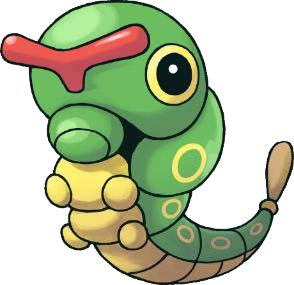
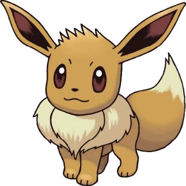
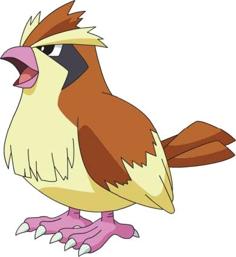
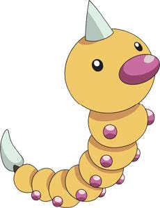

```{r setup, include = FALSE}
knitr::opts_chunk$set(echo = FALSE, message = FALSE, warning = FALSE)

if (!require(pacman)) install.packages("pacman")
library(pacman)

p_load(
  knitr, # dependency
  descr, stringr, broom, tidyverse
) # data wrangling # data wrangling

# Functions preload
set.seed(114)
```


## Overview

1. 如何找到一只高CP值（Combat Point）的宝可梦？
1. ols回归及诊断 
.center[]

---

class: inverse, bottom

# Data: Pokemon75
### A key part of Pokémon Go is using evolutions to get stronger Pokémon, and a deeper understanding of evolutions is key to being the greatest Pokémon Go player of all time. This data set covers 75 Pokémon evolutions spread across four species. A wide set of variables are provided, allowing a deeper dive into what characteristics are important in predicting a Pokémon's final combat power (CP).

---

## Data: Pokemon75

1. species: The Pokémon's type, e.g. Pidgey.
1. cp: Pre-evolution Combat Power, which is a summary of the Pokémon's strength for battling prior to the evolution of the Pokémon.
1. hp: Pre-evolution Hit Points, which is a summary of how difficult it is to weaken the Pokémon in a battle.
1. weight: Pre-evolution weight, in kilograms.
1. height: Pre-evolution height, in meters.
1. cp_new: Post-evolution Combat Power.

---

## Data: Pokemon75
### 数据集里的四个物种





---

class: inverse, bottom

# OLS Regression

---

## OLS Regression

fit1 <- lm(因变量 ~ 自变量) 


---

class: inverse, bottom

# Diagnose: Gauss–Markov Theorem

---

## Diagnose: Gauss–Markov Theorem

1. .navy[Linearity] in the parameter;
1. .navy[Nonstochastic] X ("given X," a.k.a., "X is fixed");
1. X has .navy[positive noninfinite] variance (var(X));
1. Correct .navy[specification;]
1. .red[Identification] (N > K; K = 2 for a simple OLS);
1. .red[Mean zero errors] (E(u<sub>i</sub>|X<sub>i</sub>) = 0);
1. .red[Exogeneity]: No covariance between X<sub>i</sub> and u<sub>i</sub> (E(X<sub>i</sub>u<sub>i</sub>) = cov(x<sub>i</sub>, u<sub>i</sub>) =0);
1. .red[No autocorrelation] (E(u<sub>i</sub>, u<sub>j</sub>|X<sub>i</sub>, X<sub>j</sub>) = cov(u<sub>i</sub>, u<sub>j</sub>|X<sub>i</sub>, X<sub>j</sub>) = 0, &forall; i, j);
1. .gray[Homoskedasticity] (constant variance of u<sub>i</sub>, var(u<sub>i</sub>|X) = &sigma;<sup>2</sup>);
1. No .gray[perfect collinearity] (when there are more than one X, &nexists; X<sub>i</sub> s.t., X<sub>i</sub> = a + b&sum<sub>j = 1</sub>b<sub>j</sub>X<sub>j</sub>)

---


## Reference

- 感谢 齐桐萱的Codes
- 感谢 Hung-yi Lee的Pokemon data
- 感谢 Yue Hu的Slides